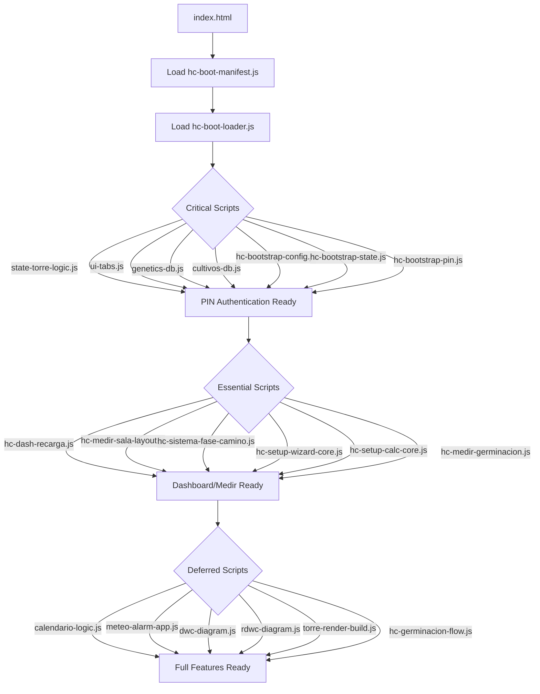
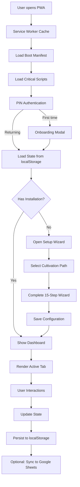
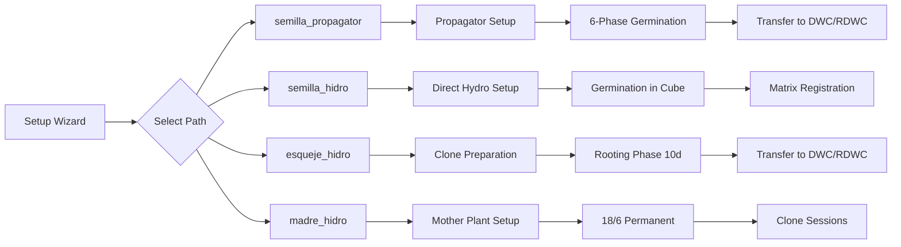
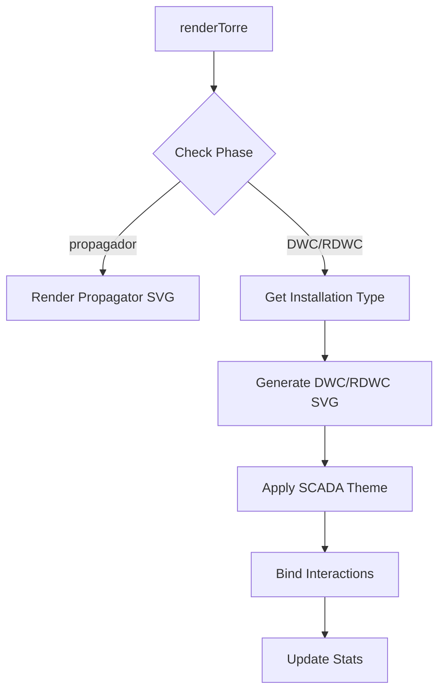
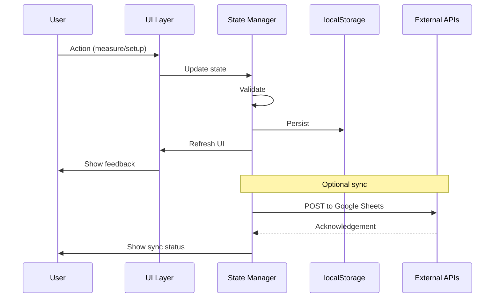

# HidroGrow - Architecture Diagram

## Overview
HidroGrow is a sophisticated Progressive Web App (PWA) for hydroponic cannabis cultivation management. It's built with vanilla JavaScript and follows a modular architecture with phased loading.

## Tech Stack

### Core Technologies
- **Frontend**: Vanilla JavaScript (ES6+), HTML5, CSS3
- **PWA**: Service Worker, Web App Manifest
- **Mobile**: Capacitor (iOS/Android wrapper)
- **Storage**: localStorage, IndexedDB (for photos)
- **External APIs**: Google Apps Script (optional backup), AEMET (weather), Open-Meteo (forecast)
- **PDF Generation**: PDFKit
- **Image Processing**: Sharp

### Dependencies
```json
{
  "@capacitor/android": "^6.2.0",
  "@capacitor/cli": "^6.2.0",
  "@capacitor/core": "^6.2.0",
  "@capacitor/filesystem": "^6.0.2",
  "@capacitor/ios": "^6.2.0",
  "@capacitor/share": "^6.0.2",
  "@capgo/capacitor-native-biometric": "^6.0.4",
  "pdfkit": "^0.18.0"
}
```

## Architecture Layers

```
┌─────────────────────────────────────────────────────────────┐
│                     PRESENTATION LAYER                        │
│  ┌──────────────┐  ┌──────────────┐  ┌──────────────┐       │
│  │   index.html │  │   main.css   │  │  brand.css   │       │
│  │  (380KB)     │  │  (583KB)     │  │  (58KB)      │       │
│  └──────────────┘  └──────────────┘  └──────────────┘       │
└─────────────────────────────────────────────────────────────┘
                              ↓
┌─────────────────────────────────────────────────────────────┐
│                    BOOT LOADING SYSTEM                        │
│  ┌──────────────────────────────────────────────────────┐   │
│  │  hc-boot-loader.js (3-tier loading)                  │   │
│  │  ├─ CRITICAL (PIN + state)                           │   │
│  │  ├─ ESSENTIAL (dash/Medir/setup)                     │   │
│  │  └─ DEFERRED (diagrams/calendar/weather)             │   │
│  └──────────────────────────────────────────────────────┘   │
└─────────────────────────────────────────────────────────────┘
                              ↓
┌─────────────────────────────────────────────────────────────┐
│                    APPLICATION LOGIC                          │
│  ┌──────────────┐  ┌──────────────┐  ┌──────────────┐       │
│  │   State Mgmt  │  │  Navigation  │  │  Auth/PIN    │       │
│  │  (bootstrap)  │  │  (init-nav)  │  │  (config)    │       │
│  └──────────────┘  └──────────────┘  └──────────────┘       │
│  ┌──────────────┐  ┌──────────────┐  ┌──────────────┐       │
│  │   Cultivation │  │  Setup Wizard│  │  Measurement │       │
│  │   Paths      │  │  (15 steps)  │  │  System      │       │
│  └──────────────┘  └──────────────┘  └──────────────┘       │
│  ┌──────────────┐  ┌──────────────┐  ┌──────────────┐       │
│  │  SVG Diagrams │  │  Weather/Meteo│  │  Calendar    │       │
│  │  (DWC/RDWC)   │  │  Integration │  │  System      │       │
│  └──────────────┘  └──────────────┘  └──────────────┘       │
└─────────────────────────────────────────────────────────────┘
                              ↓
┌─────────────────────────────────────────────────────────────┐
│                      DATA LAYER                               │
│  ┌──────────────┐  ┌──────────────┐  ┌──────────────┐       │
│  │ localStorage │  │ IndexedDB    │  │  External    │       │
│  │ (state v2)   │  │ (photos)     │  │  APIs        │       │
│  └──────────────┘  └──────────────┘  └──────────────┘       │
└─────────────────────────────────────────────────────────────┘
                              ↓
┌─────────────────────────────────────────────────────────────┐
│                    PLATFORM LAYER                             │
│  ┌──────────────┐  ┌──────────────┐  ┌──────────────┐       │
│  │   Service    │  │   Capacitor  │  │   Browser    │       │
│  │   Worker     │  │  (Mobile)    │  │  (PWA)       │       │
│  └──────────────┘  └──────────────┘  └──────────────┘       │
└─────────────────────────────────────────────────────────────┘
```

## Boot Loading System

### 3-Tier Script Loading



### Script Loading Priority

**CRITICAL (27 scripts)** - Must load before PIN unlock:
- State management
- Genetics database
- Bootstrap config/state/pin
- UI tabs
- Toast notifications

**ESSENTIAL (9 scripts)** - Load in parallel with deferred:
- Dashboard logic
- Measurement layout
- System phase management
- Setup wizard core
- Calculation core
- Germination measurement

**DEFERRED (70+ scripts)** - Load after PIN:
- Calendar logic
- Weather integration
- SVG diagrams (DWC/RDWC)
- Tower rendering
- Germination flow
- Equipment catalogs
- Premium features

## Core Application Flow



## Cultivation Paths

### 4 Main Cultivation Routes



### Path Details

| Path | Icon | Initial Phase | Key Features |
|------|------|---------------|--------------|
| semilla_propagator | 🫧 | germinacion | Propagator → 6 phases → DWC transfer |
| semilla_hidro | 💧 | germinacion | Direct hydro germination in cube |
| esqueje_hidro | 🌿 | hidro | Clone → 10-day rooting → DWC |
| madre_hidro | 👑 | hidro | Mother plant 18/6 → clone sessions |

## State Management

### Data Structure

```javascript
state = {
  // Root configuration (legacy, synced with active slot)
  configTorre: { /* installation config */ },
  torre: [ /* plant matrix */ ],
  mediciones: [ /* measurements */ ],
  registro: [ /* log entries */ ],
  ultimaMedicion: { /* last measurement */ },
  ultimaRecarga: timestamp,
  
  // Multi-slot system
  torres: [
    {
      id: timestamp,
      nombre: "Installation name",
      emoji: "🌿",
      config: { /* installation config */ },
      torre: [ /* plant matrix */ ],
      modoActual: "vegetativo",
      mediciones: [],
      registro: [],
      ultimaMedicion: null,
      ultimaRecarga: null,
      notifOpciones: {
        recarga: false,
        medicion: false,
        cosecha: false,
        esquejes: false
      }
    }
  ],
  torreActiva: 0, // active slot index
  
  // Global settings
  modo: "vegetativo",
  notifOpciones: {
    panelInicioColapsado: false
  }
}
```

### Storage Keys

- `hidrogrow_v2` - Main state
- `hc_auth` - PIN authentication timestamp
- `hc_auth_remember_min` - Remember PIN duration
- `cultivaFotos` - IndexedDB for photos
- `hg_auto_restore_point_v1` - Auto backup
- Various tutorial/coach dismissal flags

## UI Architecture

### 10 Main Tabs

```mermaid
graph TD
    A[Tab Bar] --> B[Inicio]
    A --> C[Medir]
    A --> D[Sala]
    A --> E[Sistema]
    A --> F[Calendario]
    A --> G[Riego]
    A --> H[Meteo]
    A --> I[Historial]
    A --> J[Consejos]
    A --> K[Ayuda]
    
    B --> B1[Cultivation Hubs]
    B --> B2[Phase Lifecycle]
    B --> B3[Alerts]
    
    C --> C1[EC/pH Measurement]
    C --> C2[Temperature]
    C --> C3[Volume Tracking]
    
    D --> D1[Equipment Catalog]
    D --> D2[Room Setup]
    D --> D3[Climate Control]
    
    E --> E1[SVG Diagram]
    E --> E2[Plant Matrix]
    E --> E3[System Status]
    
    F --> F1[Calendar View]
    F --> F2[Task Reminders]
    F --> F3[Harvest Dates]
    
    G --> G1[Irrigation Calc]
    G --> G2[Nutrient Mix]
    G --> G3[Water Change]
    
    H --> H1[Weather Forecast]
    H --> H2[Storm Alerts]
    H --> H3[Climate Data]
    
    I --> I1[Measurement History]
    I --> I2[Trends Graphs]
    I --> I3[Export Data]
    
    J --> J1[Growing Tips]
    J --> J2[Genetics Info]
    J --> J3[Troubleshooting]
    
    K --> K1[FAQ]
    K --> K2[Backup/Restore]
    K --> K3[Contact]
```



### Dynamic UI by Phase

The UI adapts based on cultivation phase:

| Phase | Inicio | Sistema | Medir |
|-------|--------|---------|-------|
| propagador | Germ hub | SVG dome | Dome T°/RH |
| prep_hidro | Path summary | Prep checklist | Cube prep |
| germ_cubo | 6-phase hub | DWC scheme | Pre-matrix |
| enraizado | Mounting/domo hub | SVG dome | Full protocol |
| madre | 18/6 hub | DWC scheme | Session EC/pH |
| operativa | Routine + refill | Full matrix | Reservoir + room |

## SVG Visualization System

### Diagram Architecture

```
js/diagrams/
├── hc-diagram-labels.js (label management)
├── hc-diagram-scada-theme.js (SCADA styling)
├── dwc/
│   ├── dwc-diagram.js (71KB - main DWC renderer)
│   ├── dwc-layout.js (layout calculations)
│   ├── dwc-mc-plan-diagram.js (multi-cube plans)
│   ├── dwc-scada-parts.js (SCADA components)
│   ├── dwc-scada-tokens.js (token definitions)
│   └── dwc-scada-viewport.js (viewport management)
├── rdwc/
│   ├── rdwc-diagram.js (RDWC renderer)
│   ├── rdwc-plan-diagram.js (RDWC plans)
│   ├── rdwc-presets.js (configuration presets)
│   ├── rdwc-scada-parts.js (SCADA components)
│   └── rdwc-scada-tokens.js (token definitions)
├── propagador/
│   └── propagador-diagram.js (propagator visualization)
└── torre/
    └── (tower-specific diagrams)
```

### Rendering Flow



## Key Modules

### Setup Wizard (15 Steps)

**Premium Steps (P1-P7):**
- P1: Cultivation objective
- P2: Indoor/outdoor environment
- P3: Room dimensions + equipment catalog
- P4: Climate target (T°/RH)
- P5: SOG/SCROG strategy
- P6: Origin + cultivation path
- P7: Bridge to technical setup

**Technical Steps (S1-S7):**
- S1: Rows × baskets / RDWC modules
- S2: Air pump + diffusers
- S3: Net pot fixation + water level
- S4: Nutrient + EC/pH targets
- S5: Municipality + weather preferences
- S6: Planned varieties in matrix
- S7: Installation name + save

### Germination Flow (6 Phases)

1. **semilla** - Seed in germinator (dark, 1-3 days)
2. **taproot** - Radicle visible (5-10mm)
3. **rockwool** - Seed in rockwool cube (pH 5.5)
4. **domo** - Dome + light (18/6, RH 70-80%)
5. **netpot** - Net pot + expanded clay
6. **dwc** - Seedling in productive cube

### Measurement System

**Tracked Parameters:**
- EC (Electrical Conductivity) - µS/cm
- pH - 0-14 scale
- Temperature - °C (water and air)
- Volume - Liters
- Dissolved Oxygen - mg/L (calculated)

**Measurement Locations:**
- Reservoir (depósito)
- Growing room (sala)
- Individual cubes (during germination)
- Propagator dome

### Weather Integration

**Data Sources:**
- AEMET (Spanish meteorological agency)
- Open-Meteo (forecast)
- Met.no (Norwegian meteorological institute)

**Features:**
- Weather alerts (MeteoAlarm)
- VPD (Vapor Pressure Deficit) calculations
- Climate recommendations
- Storm warnings

## Data Flow



## File Organization

### Core Structure

```
hidroGrow-web/
├── index.html (380KB - main entry)
├── manifest.json (PWA manifest)
├── service-worker.js (offline support)
├── css/
│   ├── main.css (583KB - main styles)
│   ├── hc-brand-canopy.css (58KB - branding)
│   └── hc-pm-checklist.css (20KB - checklists)
├── js/
│   ├── hc-boot-*.js (boot system)
│   ├── hc-bootstrap-*.js (bootstrap)
│   ├── hc-camino-*.js (cultivation paths)
│   ├── hc-setup-*.js (setup wizard)
│   ├── hc-medir-*.js (measurement)
│   ├── hc-germinacion-*.js (germination)
│   ├── torre-render-*.js (tower rendering)
│   ├── diagrams/ (SVG visualization)
│   ├── meteo-*.js (weather)
│   ├── calendario-*.js (calendar)
│   ├── genetics-db.js (strain database)
│   ├── cultivos-db.js (crop database)
│   └── state-torre-logic.js (state logic)
├── data/
│   ├── meteoalarm-emma-centroids.json
│   └── meteoalarm-emma-overrides.json
├── docs/ (documentation)
├── icons/ (PWA icons)
├── scripts/ (build/deployment scripts)
└── tests/ (unit tests)
```

## Security & Privacy

### PIN Authentication
- 4-digit PIN (default: 2506)
- Session-based authentication
- Optional "remember" duration
- Failed attempt limiting

### Data Storage
- Primary: localStorage (encrypted at device level)
- Photos: IndexedDB (separate database)
- Optional cloud sync: Google Apps Script (no-cors POST)
- No server dependency for core functionality

### Offline Capability
- Service worker precaches critical assets
- Network-first strategy for documents
- Cache-first for static assets
- Graceful degradation for external APIs

## Performance Optimizations

1. **Phased Loading** - Critical scripts load first, deferred in background
2. **Script Batching** - Scripts loaded in batches (10-12 at a time)
3. **Mobile Adaptation** - Smaller batches and longer yields on mobile
4. **Caching Strategy** - Service worker with versioned cache
5. **SVG Optimization** - Dynamic generation with fingerprint caching
6. **State Synchronization** - Slot-based sync to avoid redundant writes

## Deployment

### Build Process
- Version-based cache busting (`?v=2026-06-01-perf85`)
- Capacitor bundling for mobile apps
- PDF generation for documentation
- ZIP packaging for RPI (Raspberry Pi) deployment

### Platforms
- **Web**: PWA (standalone in browser)
- **iOS**: Capacitor-wrapped native app
- **Android**: Capacitor-wrapped native app
- **Raspberry Pi**: Standalone server with local files

## Key Design Patterns

1. **Module Pattern** - All JS files use IIFE modules
2. **State Management** - Centralized state with localStorage persistence
3. **Event-Driven** - Custom events for module communication
4. **Progressive Enhancement** - Core features work without deferred modules
5. **Responsive Design** - Mobile-first with desktop enhancements
6. **Offline-First** - Service worker ensures offline functionality

## External Integrations

### Optional (Non-blocking)
- Google Apps Script (backup/sync)
- AEMET (Spanish weather)
- Open-Meteo (global weather forecast)
- Met.no (Norwegian weather)

### Required
- None (app works fully offline)

## Summary

HidroGrow is a sophisticated, offline-first PWA for hydroponic cannabis cultivation. Its architecture emphasizes:

- **Performance**: Phased loading with critical/essential/deferred tiers
- **Reliability**: Offline-first with service worker caching
- **Flexibility**: 4 cultivation paths with phase-adaptive UI
- **Privacy**: Local-first storage with optional cloud sync
- **Maintainability**: Modular vanilla JavaScript with clear separation of concerns

The app successfully manages complex cultivation workflows while remaining fully functional without internet connectivity, making it ideal for grow rooms with limited network access.
