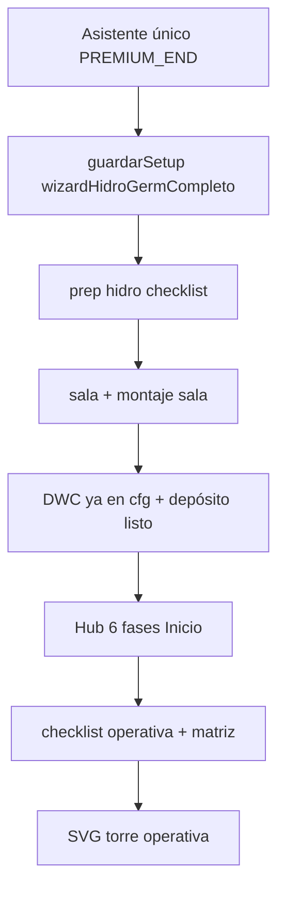

# Auditoría profunda — `semilla_hidro`

Fecha de revisión: alineada con commit de camino semilla hidro. Referencias: [SEMILLA-HIDRO-CAMINO.md](./SEMILLA-HIDRO-CAMINO.md), [SEMILLA-HIDRO-PRUEBA.md](./SEMILLA-HIDRO-PRUEBA.md).

---

## Mapa del flujo (código)



---

## Qué funciona bien

| Área | Evidencia |
|------|-----------|
| Pestaña Sala visible | `hcOcultarTabSalaDuranteCamino` solo `semilla_propagador` |
| Fases Sistema | `prep_hidro` → `germ_cubo` → esquema (`getSistemaFaseCamino`) |
| Checklist prep | `ITEMS_PREP_HIDRO` + `preparacionGermHidroChecks` |
| 6 fases obligatorias | `germinacionConcluida` → `fasesCompletadas`; hub copy + anillo `%` |
| Asistente con DWC | `getSetupUltimoPasoIndice` → `PREMIUM_END`; skip solo Cultivos/Resumen |
| Plan germ en setup | `hcCaminoSemillaGermEnSetup`, `renderPremiumGermPlanUI` |
| Meteo en prep | `hcMeteoTabPermitidaSinOperativa` para hidro sin depósito operativo |
| Medir sin modo domo | `hcMedirModoGerminacionPropagador` solo propagador |
| Tests estáticos | `tests/semilla-hidro-camino.test.mjs` (7 OK) |

---

## Hallazgos corregidos en esta auditoría

### 1. Sala «configurada» en wizard pero bloqueada en hub

**Problema:** `salaPreGermConfigurada` exigía `salaPreGermConfigAt`, que solo se ponía al guardar el mini-asistente de sala (`faseSalaPreGerm`), no al cerrar el asistente completo hidro (sala ya en paso 3–4).

**Síntoma:** Tras guardar, banner «Configura sala» aunque el usuario ya eligió carpa/LED en el wizard.

**Corrección:** En `guardarSetupYContinuarCore`, si `wizardHidroGermCompleto` y hay datos de sala/equipamiento, se escribe `salaPreGermConfigAt`.

### 2. Sin validación de plan al guardar asistente completo

**Problema:** `validarPlanGerminacionCompleto` solo corría en `faseGermSetup` (propagador / wizard corto). En hidro con `PREMIUM_END`, `faseGermSetup` era false → se podía guardar sin fecha de siembra o semillas.

**Corrección:** Mismo bloque de validación para `wizardHidroGermCompleto`; validación en paso 6 con `validarPremiumGermPlan`.

### 3. Post-setup saltaba el checklist prep

**Problema:** Tras guardar, `hcSetupFase === 'hidro'` → `iniciarFlujoInstalacionPostSetup` iba directo a montaje de sala, no al modal prep hidro (el propagador sí abría checklist con `hcSetupFase === 'germinacion'`).

**Corrección:** `transicionHidroPrepChecklist` + rama en `iniciarFlujoInstalacionPostSetup` para `semilla_hidro` con prep incompleto.

---

## Riesgos / deuda (sin cambio aún)

| ID | Tema | Notas |
|----|------|-------|
| R1 | Copy onboarding / nutriente / prep | **Corregido** — textos hidro en onboarding, nutriente cubo, inline prep, sistema germ_cubo, card camino |
| R2 | Matriz 5×5 vs semillas | Tras wizard completo se usa geometría DWC (`initTorreMatrizVacia`), no 1×N como propagador; coherente con cubo único, pero conviene probar N cestas = N semillas |
| R3 | `hcGerminacionBloqueada` CTA `hidro_config` | Tras wizard completo `hidroInstalacionCerrada` suele ser true; si falla checklist instalación, el CTA puede confundir — probar en UI |
| R4 | Nutriente paso 4 | `validarPremiumNutrienteGerm` en paso 4; hidro puede avanzar sin nutriente bandeja hasta guardar — aceptable si el checklist prep lo exige |
| R5 | Instalaciones independientes | OK por diseño (`state.torres`); probar cambio de torre con dos caminos distintos |

---

## Checklist manual obligatorio (tras fixes)

Seguir [SEMILLA-HIDRO-PRUEBA.md](./SEMILLA-HIDRO-PRUEBA.md) en navegador:

1. Nuevo → Semilla en hidro → completar hasta DWC → **debe abrir prep hidro** al guardar.
2. Completar prep → montaje sala → primer llenado → hub con % fases.
3. Intentar guardar sin fecha en paso 6 → **debe bloquear**.
4. Sala ya en wizard → **no** debe pedir «Configurar sala» de nuevo (solo montaje si falta verificación).

Automático:

```bash
node --test tests/semilla-hidro-camino.test.mjs
```

---

## Archivos tocados en la corrección

- `js/hc-setup-calc-core.js` — sala, validación, checklist tras guardar
- `js/hc-instalacion-lifecycle.js` — post-setup prep hidro
- `js/hc-premium-wizard.js` — validación paso 6
- `js/hc-premium-germ-plan.js` — mensaje sustrato hidro
