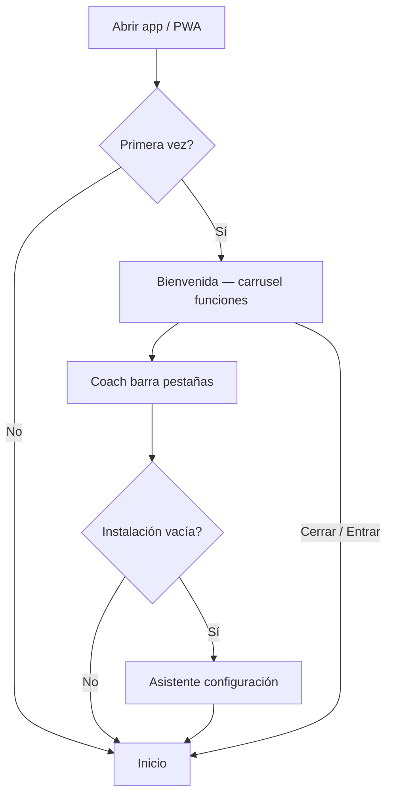
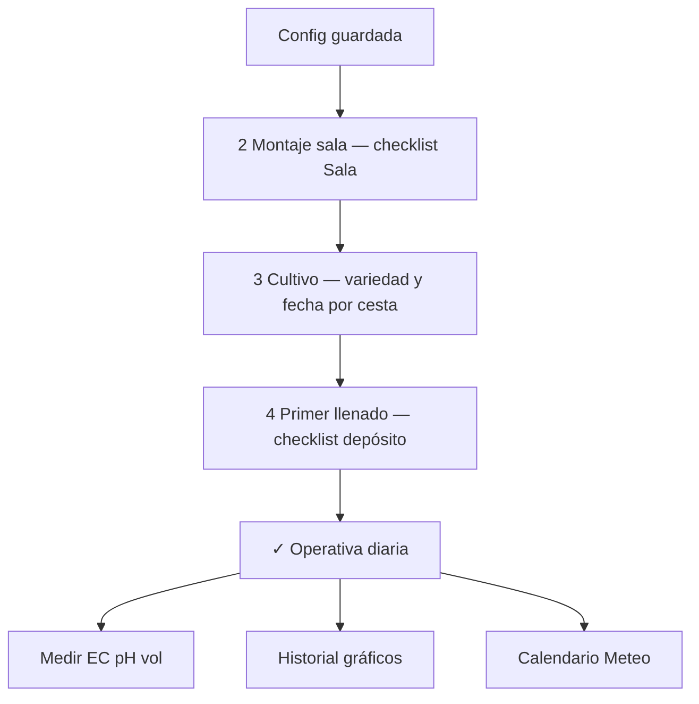
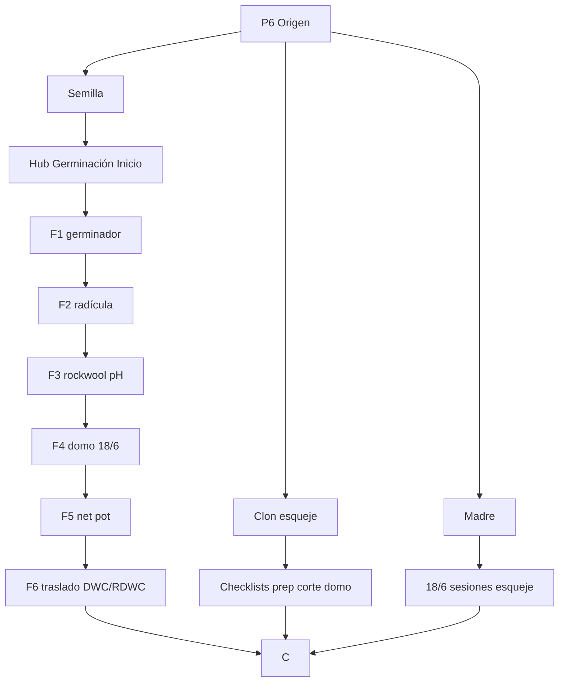
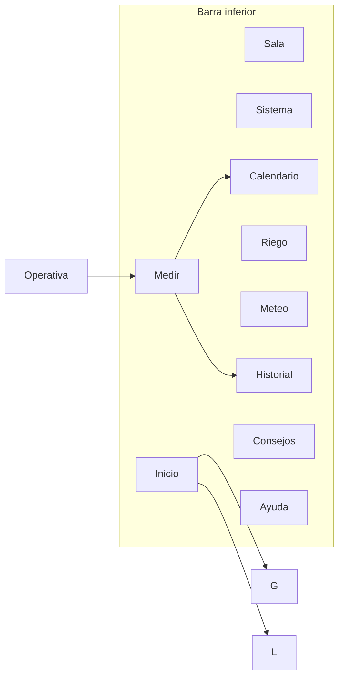

# HidroGrow — Diagrama de flujo completo

**Versión:** 2026-05-31 · **Sistemas:** DWC y RDWC únicamente · **PDF:** [`HidroGrow-diagrama-flujo-completo.pdf`](HidroGrow-diagrama-flujo-completo.pdf)

Regenerar PDF:

```bash
npm run docs:flujo-pdf
```

---

## 1. Arranque y onboarding



---

## 2. Asistente de configuración (15 pasos)

```mermaid
flowchart LR
  subgraph P0[P0 Tipo]
    P0a[DWC o RDWC]
  end
  subgraph Premium[P1–P7 Premium]
    P1[Objetivo legal]
    P2[Entorno int/ext]
    P3[Espacio equip]
    P4[Clima luz]
    P5[SOG SCROG genética]
    P6[Origen planta]
    P7[Puente montaje]
  end
  subgraph Tecnico[S1–S7 Técnico]
    S1[Geometría sistema]
    S2[Equip hidráulico]
    S3[Agua cestas]
    S4[Nutriente]
    S5[Meteo]
    S6[Cultivos]
    S7[Resumen guardar]
  end
  P0 --> P1 --> P2 --> P3 --> P4 --> P5 --> P6 --> P7 --> S1 --> S2 --> S3 --> S4 --> S5 --> S6 --> S7
  S7 --> L[Lifecycle Inicio]
```



---

## 3. Ciclo de instalación (hub Inicio)



---

## 4. Origen de planta (ramas)



---

## 5. Pestañas y rutina diaria



| Pestaña | Uso principal |
|---------|----------------|
| Inicio | Progreso, germinación, resumen, accesos |
| Medir | Registro, asistente, PRO, IoT, recarga |
| Sala | Montaje, LED, clima sala |
| Sistema | Matriz, diagrama DWC/RDWC |
| Historial | Gráficos, seguimiento vs teórico |
| Calendario | Recordatorios, esquejes |
| Consejos | Guías, flujo app, genéticas |
| Ayuda | FAQ, backup, reabrir bienvenida |

---

## 6. Notas

- **Tienda de semillas** (top 10 en asistente) ≠ **propagador** (equipamiento en hub Germinación).
- Datos en `hidrogrow_v2` (local). Sin servidor obligatorio.
- Valores EC/pH/VPD son orientativos; priorizar medidor y ficha de variedad.
