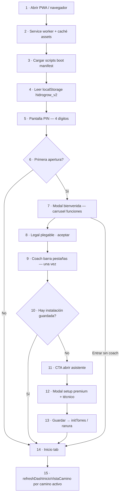
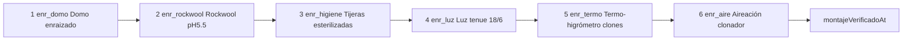
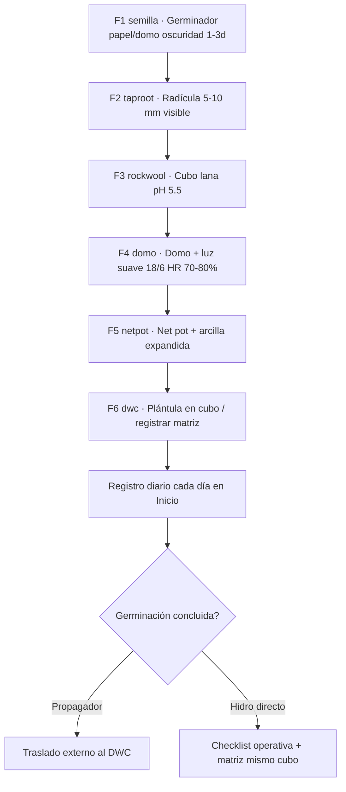
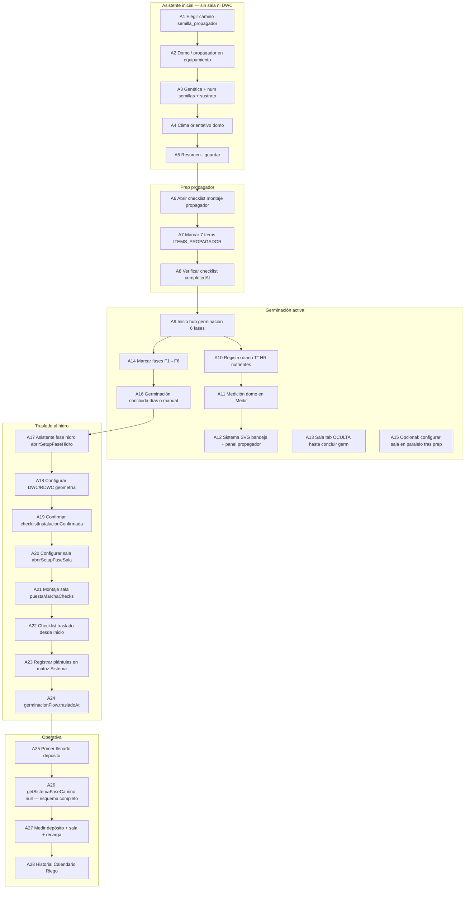
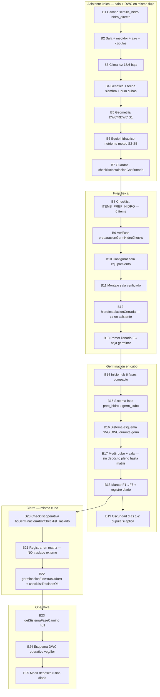
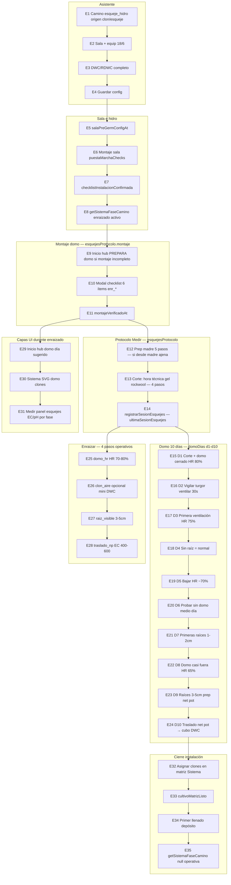
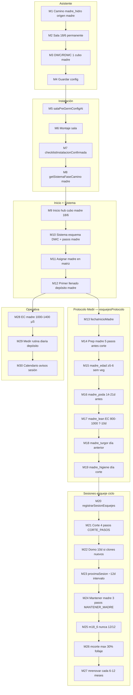
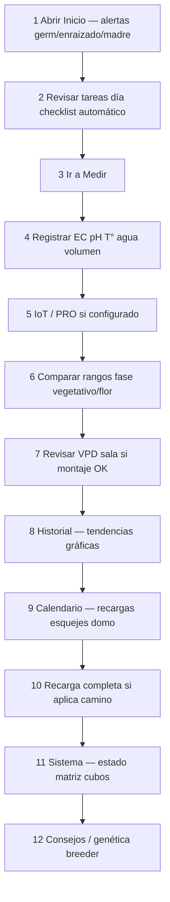

# HidroGrow — Diagrama de flujo completo (todos los pasos)

**Versión:** 2026-06-01 · **Build:** perf60+ · **PDF resumen:** [`HidroGrow-diagrama-flujo-completo.pdf`](HidroGrow-diagrama-flujo-completo.pdf)

Regenerar PDF resumido: `npm run docs:flujo-pdf`

**Regla de oro:** cada instalación (ranura/torre) es **independiente**. Varios caminos coexisten; no comparten progreso.

---

## Índice

1. [Arranque y onboarding](#1-arranque-y-onboarding)
2. [Asistente — 15 pasos detallados](#2-asistente--15-pasos-detallados)
3. [Checklists físicos — ítems uno a uno](#3-checklists-físicos--ítems-uno-a-uno)
4. [6 fases de germinación (semilla)](#4-6-fases-de-germinación-semilla)
5. [Camino A — semilla_propagador (paso a paso)](#5-camino-a--semilla_propagador-paso-a-paso)
6. [Camino B — semilla_hidro (paso a paso)](#6-camino-b--semilla_hidro-paso-a-paso)
7. [Camino C — esqueje_hidro (paso a paso)](#7-camino-c--esqueje_hidro-paso-a-paso)
8. [Camino D — madre_hidro (paso a paso)](#8-camino-d--madre_hidro-paso-a-paso)
9. [Operativa diaria (post-instalación)](#9-operativa-diaria-post-instalación)
10. [Pestañas y capas UI](#10-pestañas-y-capas-ui)
11. [Datos persistidos por ranura](#11-datos-persistidos-por-ranura)
12. [Archivos de código](#12-archivos-de-código)

---

## 1. Arranque y onboarding

---

## 2. Asistente — 15 pasos detallados

```mermaid
flowchart TD
  subgraph P0[P0 — Tipo sistema]
    P0a[P0.1 Elegir DWC o RDWC]
  end
  subgraph PR[P1–P7 Premium]
    P1[P1.1 Objetivo cultivo]
    P1b[P1.2 Legalidad / uso responsable]
    P2[P2.1 Entorno interior o exterior]
    P3[P3.1 Dimensiones sala / carpa]
    P3b[P3.2 Catálogo equip ES — LED extractor propagador]
    P4[P4.1 Clima objetivo T° HR]
    P4b[P4.2 Luz fotoperiodo VPD orientativo]
    P5[P5.1 SOG o SCROG]
    P5b[P5.2 Genética foto / auto]
    P6[P6.1 Origen semilla clon madre]
    P6b[P6.2 Camino cultivo — 4 rutas]
    P7[P7.1 Puente montaje · resumen premium]
  end
  subgraph ST[S1–S7 Técnico hidro]
    S1[S1.1 Filas × cestas / módulos RDWC]
    S1b[S1.2 Litros depósito · cubos independientes]
    S2[S2.1 Bomba aire · difusores · medidor]
    S3[S3.1 Fijación net pots · nivel agua diseño]
    S4[S4.1 Nutriente · dosis orientativas EC pH]
    S5[S5.1 Municipio AEMET · preferencias]
    S6[S6.1 Variedades en matriz planificadas]
    S7[S7.1 Nombre instalación · guardar config]
  end
  P0a --> P1 --> P1b --> P2 --> P3 --> P3b --> P4 --> P4b --> P5 --> P5b --> P6 --> P6b --> P7
  P7 --> S1 --> S1b --> S2 --> S3 --> S4 --> S5 --> S6 --> S7
  S7 --> CAM{Camino guardado}
```

| Paso | Contenido | Varía por camino |
|------|-----------|------------------|
| P0 | DWC / RDWC | Igual |
| P1–P5 | Objetivo, sala, clima, genética | Igual |
| P6 | Origen + **caminoCultivo** | **Define toda la ruta** |
| P7 | Puente | Igual |
| S1–S7 | Geometría hidro | Propagador: **omitido** (sin S1–S7 completo) |
| Post-guardar | Checklist según camino | Ver secciones 5–8 |

---

## 3. Checklists físicos — ítems uno a uno

### 3.1 Propagador (`propagadorMontajeChecks`) — 7 ítems

### 3.2 Prep hidro semilla (`preparacionGermHidroChecks`) — 6 ítems

### 3.3 Enraizado esqueje (`esquejesProtocolo.montaje`) — 6 ítems

### 3.4 Montaje sala (`puestaMarchaChecks`)

Checklist dinámico según equipamiento registrado (LED, extractor, filtro, etc.). Requiere `completedAt` + fingerprint equipamiento (`hcPmEquipFpAtVerify`).

### 3.5 Primer llenado depósito

Checklist depósito (`instalacionPrimerLlenadoAt`) — EC, pH, volumen, oxigenación, limpieza.

---

## 4. 6 fases de germinación (semilla)

Aplican a **semilla_propagador** y **semilla_hidro** (hub `#dashGerminacionHub`).

| Fase | ID | Acción usuario |
|------|-----|----------------|
| 1 | `semilla` | Marcar en hub · registro diario |
| 2 | `taproot` | Marcar cuando radícula visible |
| 3 | `rockwool` | Semilla en cubo |
| 4 | `domo` | Domo/cúpula + luz |
| 5 | `netpot` | Net pot preparado |
| 6 | `dwc` | En cubo productivo / matriz |

---

## 5. Camino A — semilla_propagador (paso a paso)

**Resumen Inicio (`getCaminoResumenPasos`):** Montaje propagador → Sala cfg → Montaje sala → Germ 6 fases → (si concluida) DWC → Traslado → Matriz → Depósito.

---

## 6. Camino B — semilla_hidro (paso a paso)

**Cadena CTA (`hcSiguientePasoSemillaHidro`):** Prep hidro → Sala → Montaje → DWC (si falta) → Depósito → 6 fases Inicio.

**Resumen Inicio:** Prep hidro → Sala → Montaje → DWC cerrado → Depósito germ → 6 fases → Checklist operativa → Matriz.

---

## 7. Camino C — esqueje_hidro (paso a paso)

**Cadena CTA (`hcSiguientePasoEsquejeHidro`):** Asistente → Sala → Montaje → DWC → Checklist enraizado → Matriz → Depósito → Hub domo.

**EC/pH por fase (Medir):** clonador 48h 0-400 µS → enraizamiento 300-600 → traslado dwc 400-600.

---

## 8. Camino D — madre_hidro (paso a paso)

**Cadena CTA (`hcSiguientePasoMadreHidro`):** Asistente → Sala → Montaje → DWC → Matriz madre → Depósito → Medir.

---

## 9. Operativa diaria (post-instalación)

---

## 10. Pestañas y capas UI

### 10.1 Barra inferior (10 pestañas)

| # | Pestaña | ID | Cuándo principal |
|---|---------|-----|------------------|
| 1 | Inicio | `tab-inicio` | Hubs fase + lifecycle |
| 2 | Medir | `tab-mediciones` | Registro diario |
| 3 | Sala | `tab-sala` | Equip + montaje |
| 4 | Sistema | `tab-sistema` | SVG + matriz |
| 5 | Calendario | `tab-calendario` | Hitos |
| 6 | Riego | `tab-riego` | Post-depósito |
| 7 | Meteo | `tab-meteo` | AEMET |
| 8 | Historial | `tab-historial` | Gráficos |
| 9 | Consejos | `tab-consejos` | Guías |
| 10 | Ayuda | `tab-ayuda` | FAQ backup |

### 10.2 Matriz Inicio / Sistema / Medir por fase

| Fase | Inicio | Sistema | Medir |
|------|--------|---------|-------|
| Propagador | Hub germ / ruta oculta | SVG domo + panel | Domo T° HR |
| prep_hidro | Resumen camino | Checklist prep | Prep cubo |
| germ_cubo | Hub 6 fases | Esquema DWC | Cubo pre-matriz |
| enraizado | Hub montaje / domo | SVG domo | Protocolo completo |
| madre | Hub 18/6 | Esquema DWC | Sesiones EC/pH |
| null operativa | Rutina + recarga | Matriz completa | Depósito + sala |

---

## 11. Datos persistidos por ranura

| Clave | Contenido |
|-------|-----------|
| `caminoCultivo` | Ruta activa |
| `premiumSetup` | Borrador asistente |
| `germinacionFlow` | Fases semilla, traslado, registro |
| `propagadorMontajeChecks` | 7 ítems propagador |
| `preparacionGermHidroChecks` | 6 ítems prep cubo |
| `esquejesProtocolo.montaje` | 6 ítems enraizado |
| `esquejesProtocolo.montajeVerificadoAt` | Checklist enraizado OK |
| `esquejesProtocolo.corte` | 4 pasos corte |
| `esquejesProtocolo.domoDias` | 10 días d1-d10 |
| `esquejesProtocolo.prepMadre` | 5 pasos prep madre |
| `esquejesProtocolo.mantener` | 3 pasos mantener |
| `puestaMarchaChecks` | Montaje sala |
| `checklistInstalacionConfirmada` | Asistente DWC cerrado |
| `instalacionPrimerLlenadoAt` | Depósito operativo |

---

## 12. Archivos de código

| Módulo | Archivo |
|--------|---------|
| Fases | `js/hc-camino-fase.js` |
| Panel Sistema | `js/hc-sistema-fase-camino.js` |
| Caminos / resumen pasos | `js/hc-camino-cultivo.js` |
| UI pestañas | `js/hc-camino-flujo-ui.js` |
| Germinación 6 fases | `js/hc-germinacion-flow.js` |
| Checklists domo/prep | `js/hc-propagador-montaje.js` |
| Esquejes / madre / domo 10d | `js/hc-esquejes-madre.js` |
| Lifecycle CTAs | `js/hc-instalacion-lifecycle.js` |
| Torres multi-install | `js/hc-bootstrap-state.js` |
| SVG propagador | `js/diagrams/propagador/propagador-diagram.js` |

---

## Mapas detallados por camino

| Camino | Documento |
|--------|-----------|
| Propagador | [PROPAGADOR-CAMINO.md](./PROPAGADOR-CAMINO.md) |
| Semilla hidro | [SEMILLA-HIDRO-CAMINO.md](./SEMILLA-HIDRO-CAMINO.md) |
| Cuatro caminos | [FLUJO-CAMINOS.md](./FLUJO-CAMINOS.md) |

---

## Notas

- EC/pH/HR orientativos; priorizar medidor y ficha breeder.
- Tienda semillas (top 10) ≠ propagador equipamiento germinación.
- Datos locales `hidrogrow_v2`; sin servidor obligatorio.
