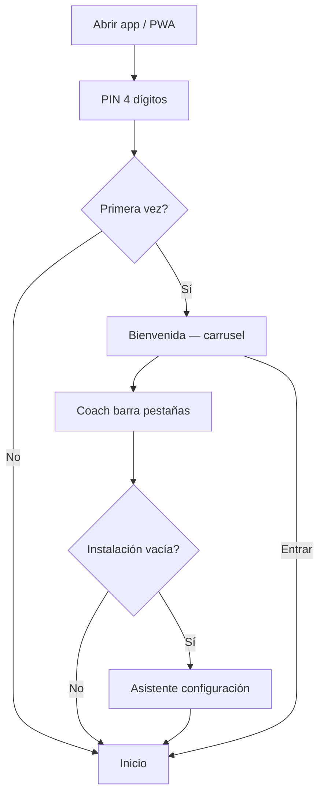
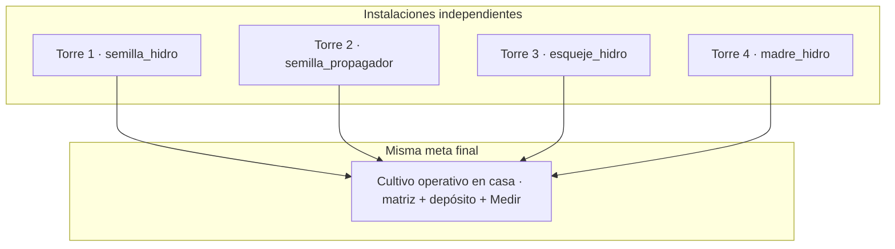
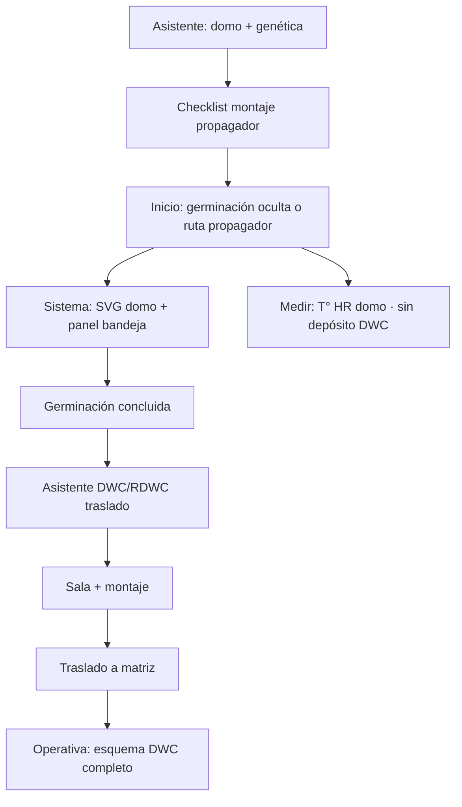
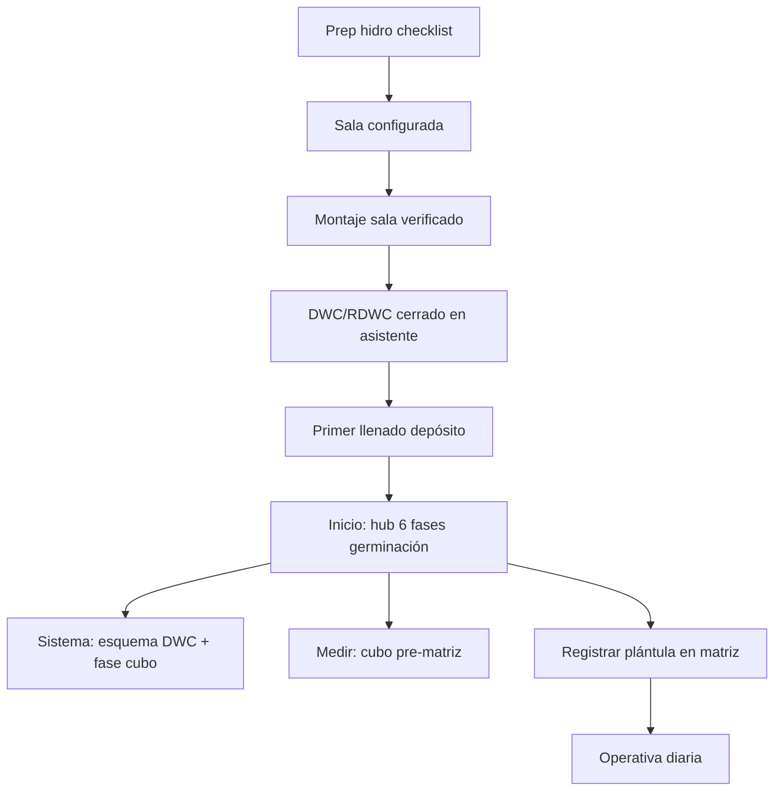
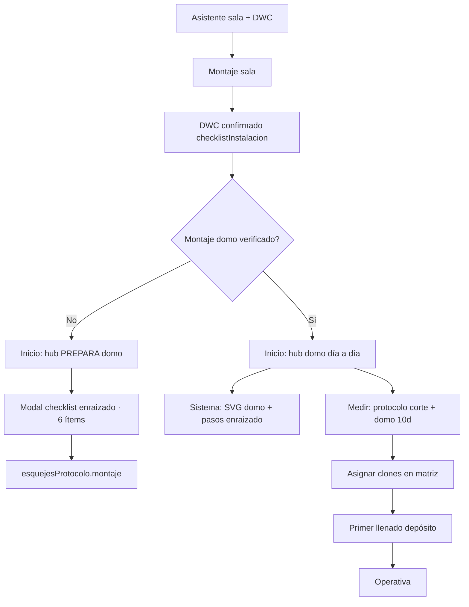
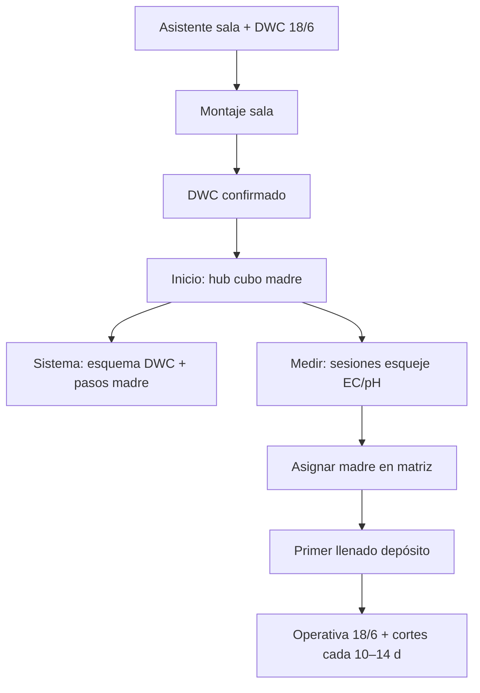
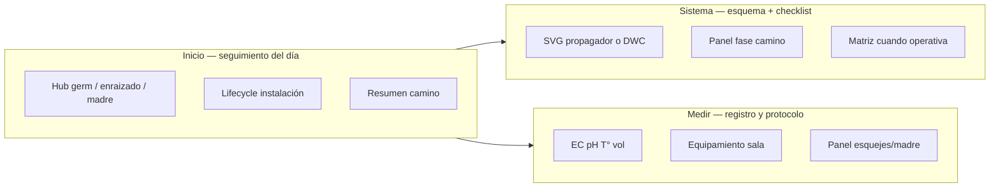
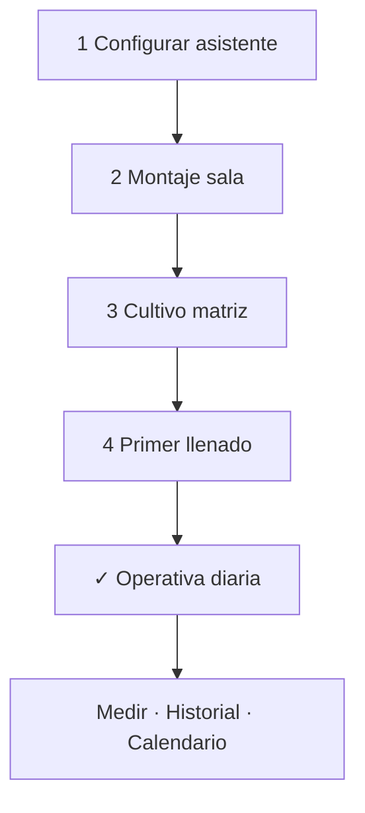
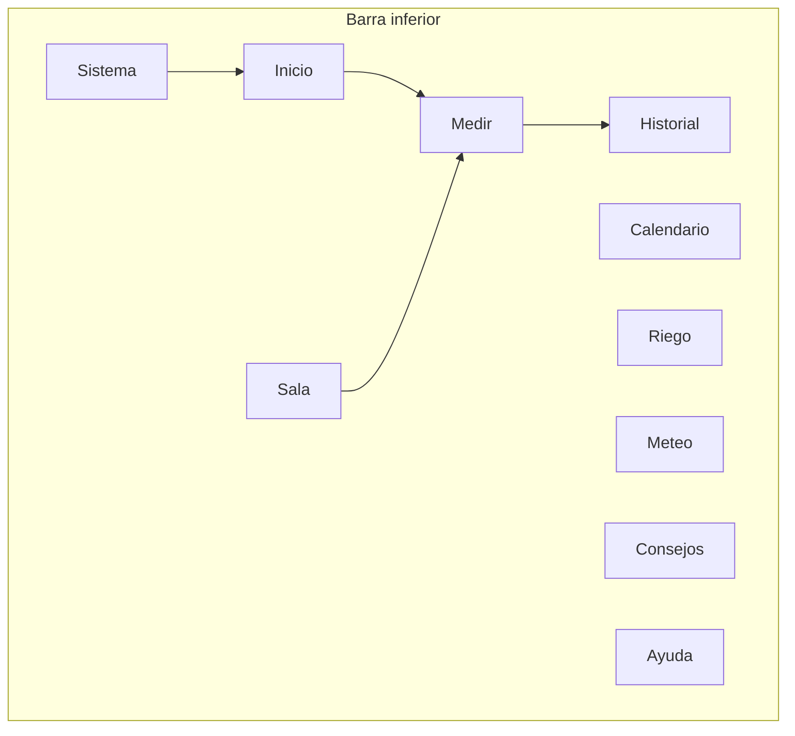

# HidroGrow — Diagrama de flujo completo

**Versión:** 2026-06-01 · **Build:** perf60 · **Sistemas:** DWC y RDWC · **PDF:** [`HidroGrow-diagrama-flujo-completo.pdf`](HidroGrow-diagrama-flujo-completo.pdf)

Regenerar PDF:

```bash
npm run docs:flujo-pdf
```

**Regla de oro:** cada instalación (ranura/torre) es **independiente**. Varios caminos pueden coexistir; no comparten progreso ni config.

---

## 1. Arranque y onboarding



**Persistencia:** `localStorage` clave `hidrogrow_v2` · ranuras en `state.torres[]` · activa en `state.torreActiva`.

---

## 2. Asistente de configuración

```mermaid
flowchart LR
  subgraph P0[P0 Tipo]
    P0a[DWC o RDWC]
  end
  subgraph Premium[P1–P7 Premium]
    P1[Objetivo legal]
    P2[Entorno int/ext]
    P3[Espacio equip]
    P4[Clima luz VPD]
    P5[SOG SCROG genética]
    P6[Origen + camino cultivo]
    P7[Puente montaje]
  end
  subgraph Tecnico[S1–S7 Técnico]
    S1[Geometría sistema]
    S2[Equip hidráulico]
    S3[Agua cestas]
    S4[Nutriente]
    S5[Meteo municipio]
    S6[Cultivos / plan]
    S7[Resumen guardar]
  end
  P0 --> P1 --> P2 --> P3 --> P4 --> P5 --> P6 --> P7 --> S1 --> S2 --> S3 --> S4 --> S5 --> S6 --> S7
  S7 --> CAM{Camino elegido}
```



**P6 define el camino** (no mezclable por ranura):

| ID camino | Origen | Asistente inicial |
|-----------|--------|-------------------|
| `semilla_propagador` | Semilla | Sin sala ni DWC (solo domo) |
| `semilla_hidro` | Semilla | Sala + DWC/RDWC en un solo asistente |
| `esqueje_hidro` | Esqueje/clon | Sala + DWC/RDWC |
| `madre_hidro` | Madre | Sala + DWC/RDWC (18/6) |

---

## 3. Cuatro caminos — vista global



Módulo central de fases: `getSistemaFaseCamino()` en `hc-camino-fase.js`.  
Cadena de “siguiente paso”: `hcSiguientePasoInstalacion()` → delega en `hcSiguientePaso*Hidro` por camino.

---

## 4. Camino A — Semilla propagador



**Inicio en germ activa:** hub germ oculto; monitor en Sala.  
**Post-traslado:** `germinacionFlow.trasladoAt` → Medir permite depósito; Sistema modo hidro.

---

## 5. Camino B — Semilla hidro



**Separación UX (perf58):** Inicio = solo 6 fases; Sistema = esquema DWC; sin matriz/llenado duplicados en Inicio.

---

## 6. Camino C — Esqueje hidro



**Fuente única montaje (perf60):** `esquejesProtocolo.montaje` + `montajeVerificadoAt` (modal, Inicio, Medir, Sistema sincronizados).  
**Operativa post-corte:** prep → corte → enraizar → `domoDias` (10 d) en Medir.

---

## 7. Camino D — Madre hidro



---

## 8. Tres capas de UI por fase



| Fase | Inicio | Sistema | Medir |
|------|--------|---------|-------|
| Propagador germ | Ruta / oculto | SVG domo | Domo, sin depósito |
| Semilla hidro germ | 6 fases | Esquema DWC | Cubo pre-matriz |
| Esqueje enraizado | Hub domo | SVG domo | Protocolo completo |
| Madre | Hub 18/6 | Esquema DWC | Sesiones + EC |

---

## 9. Ciclo lifecycle genérico (Inicio)



CTA único: `hcSiguientePasoInstalacion()` evita botones divergentes entre rail, hub y banners.

---

## 10. Pestañas de la app



| Pestaña | Rol |
|---------|-----|
| **Inicio** | Hub fase activa, lifecycle, accesos rápidos |
| **Medir** | Mediciones, recarga, protocolo clones/madre |
| **Sala** | Equipamiento, montaje, clima sala |
| **Sistema** | Fase camino + esquema SVG + matriz |
| **Calendario** | Domo día a día, sesiones esqueje, recargas |
| **Historial** | Gráficos EC/pH vs objetivo |
| **Consejos** | Guías, genéticas, equipamiento |
| **Ayuda** | FAQ, backup, reabrir bienvenida |

---

## 11. Datos clave por ranura

| Clave / objeto | Uso |
|----------------|-----|
| `caminoCultivo` | semilla_propagador · semilla_hidro · esqueje_hidro · madre_hidro |
| `germinacionFlow` | Semilla: fases, traslado, registro diario |
| `propagadorMontajeChecks` | Propagador: domo verificado |
| `preparacionGermHidroChecks` | Semilla hidro: prep cubo |
| `esquejesProtocolo` | Esqueje/madre: montaje, corte, domo 10d, sesiones |
| `puestaMarchaChecks` | Montaje sala verificado |
| `checklistInstalacionConfirmada` | Asistente DWC cerrado |
| `instalacionPrimerLlenadoAt` | Depósito operativo |

---

## 12. Archivos principales

| Área | JavaScript |
|------|------------|
| Fases camino | `hc-camino-fase.js` |
| Panel Sistema | `hc-sistema-fase-camino.js` |
| Caminos / pasos | `hc-camino-cultivo.js` |
| UI pestañas | `hc-camino-flujo-ui.js` |
| Germinación | `hc-germinacion-flow.js` |
| Checklists domo | `hc-propagador-montaje.js` |
| Esquejes / madre | `hc-esquejes-madre.js` |
| Lifecycle CTAs | `hc-instalacion-lifecycle.js` |
| Torres / multi-install | `hc-bootstrap-state.js`, `app-hc-torres-badges-notifs.js` |

---

## 13. Mapas detallados por camino

| Camino | Documento |
|--------|-----------|
| Propagador | [PROPAGADOR-CAMINO.md](./PROPAGADOR-CAMINO.md) |
| Semilla hidro | [SEMILLA-HIDRO-CAMINO.md](./SEMILLA-HIDRO-CAMINO.md) |
| Cuatro caminos | [FLUJO-CAMINOS.md](./FLUJO-CAMINOS.md) |

---

## 14. Notas

- Valores EC/pH/HR son orientativos; priorizar medidor y ficha del breeder.
- **Tienda semillas** (top 10 asistente) ≠ **propagador** (equipamiento germinación).
- Sin servidor obligatorio; datos locales en el dispositivo.
